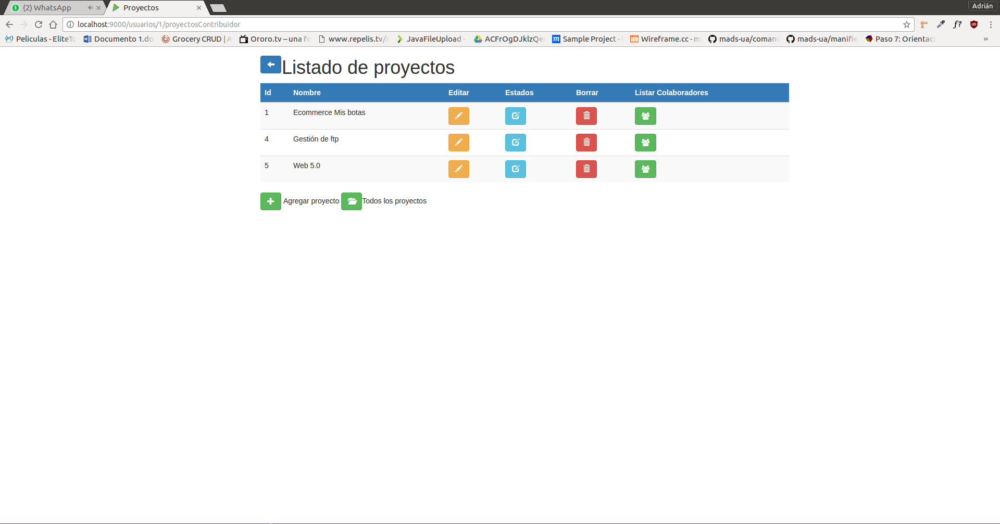
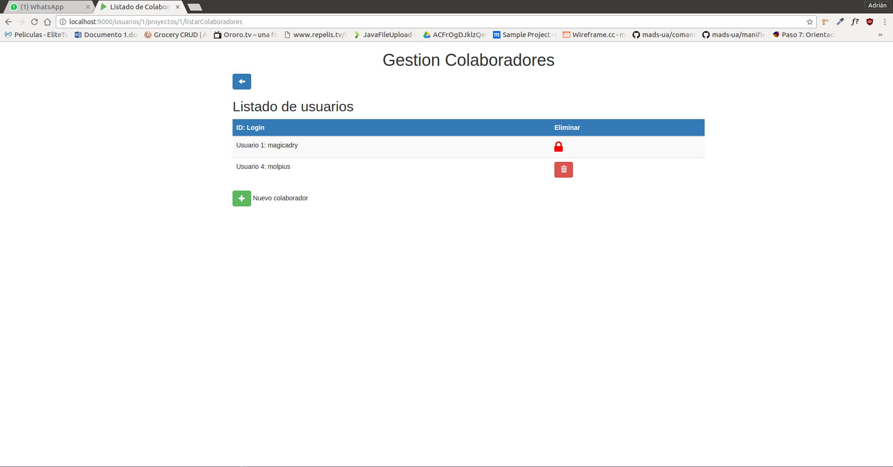
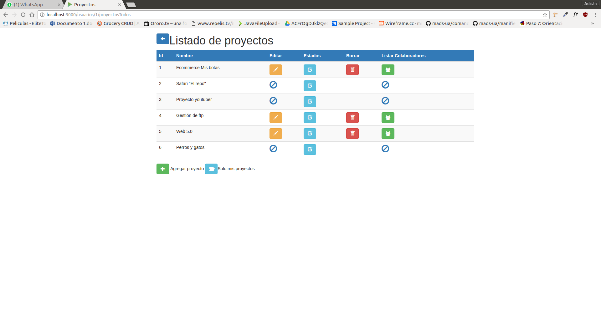
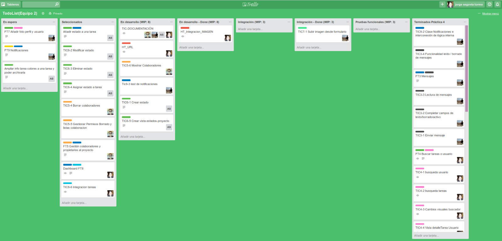
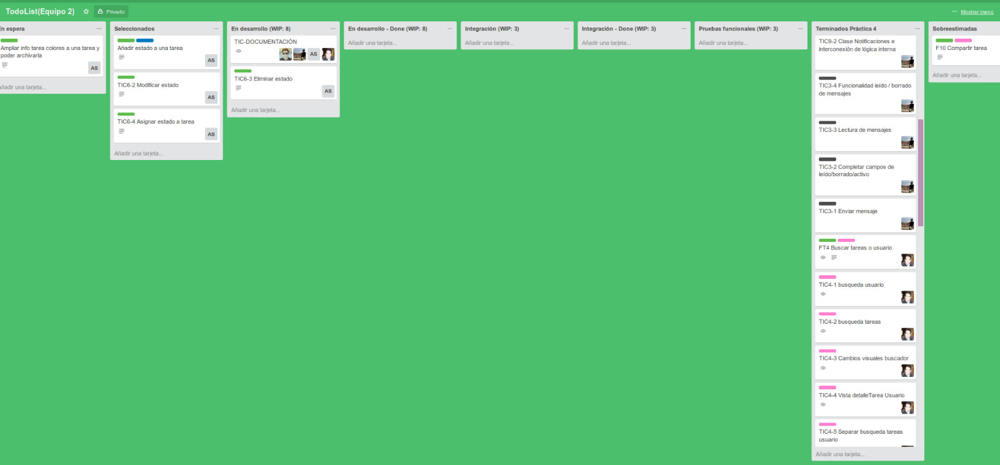

# Sprint de Scrum

##### Integrantes
- Javier Molpeceres Gómez
- Adrián Gosálvez Maciá
- Alberto Sapiña Mora
- Jorge Segovia Tormo

##### Repositorio

https://github.com/jst7/mads-todolist

##### Tablero de Trello

https://trello.com/b/oXhIBL9Y/todolist-equipo-2

### Índice

1. Historias de usuario

2. Funcionalidades implementadas (breve descripción para el usuario y breve descripción técnica).

3. Informe sobre la metodología seguida (ejemplos de evolución del tablero, alguna métrica del desarrollo realizado en el sprint)

4. Informes sobre las reuniones de Scrum (planificación del sprint, 3 scrum diario, revisión).

5. Resultado de la retrospectiva: qué ha ido bien y qué se podría mejorar.


# Historias de usuario


### 1. Notificaciones

##### Descripción
	El usuario podrá ver notificaciones para estar informado de toda la actividad.

##### COS
	Se podran ver mensajes que formarán un registro de los cambios realizados e iteracciones de la aplicación


### 2. Mensajes

##### Descripción
	El usuario podrá enviar mensajes a otro usuario para poder comunicarse.

##### COS
	Un usuario puede enviar mensajes, recibirlos y leerlos.


### 3. Buscar tareas o usuarios

##### Descripción
	Como usuario quiero buscar tareas o usuarios para poder encontrarlas más fácilmente.

##### COS
	1, A partir de un texto poder filtrar tareas por su descripción, usuarios por login
	2. A partir de una operación de busqueda poder filtrar por alguna caracteristica del usuario o tarea.


### 4. Gestión de propietarios y colaboradores de proyectos

##### Descripción
	Como usuario de un proyecto quiero poder añadir colaboradores al proyecto.

##### COS
	1. Ver la lista de colaboradores de un proyecto y verificar que un nuevo usuario se ha añadido.
	2. Verificar que un usuario añadido a un proyecto puede acceder al proyecto.
	3. Borrar colaboradores de proyecto y vereficar que no tienen asignado ese proyecto.
	4. Comprobar que al borrar el proyecto se borra el proyecto a estos colaboradores.
	5. Añadir dueño del proyecto, este será el único que puede borrar y agregar colaboradores al proyecto.


### 5. Dashboard

##### Descripción
	El usuario quiere un dashboard para poder ver las tareas, notifiaciones y proyectos de un vistazo al inicio y saber el estado de todo rápidamente.
	El usuario quiere poder modificar los colores de su interfaz para su comodidad.

##### COS
	1. Se debe haber creado una vista que muestre proyectos, tareas y notificaciones de un usuario.
	2. Añadir botón para seleccionarlo y al interactuar con él cambiarán los colores según la elección.
	3. Poder seleccionar uno de los bloques del dashboard y poder ver su vista.


### 6. Añadir estado a una tarea

##### Descripción
    Como usuario quiero poder asignar el estado a una tarea para conocer el estado de cómo va el proyecto así como crear, modificar y eliminar estados personalizados de cada proyecto.

##### COS
    1. Gestionar estados del proyecto.
    2. Añadir un estado a una tarea y poder visualizar en qué estado se encuentra la misma.
    3. Visualizar campo estado en la lista de tareas.
    4. Resumen en la descripción del proyecto.


### 7. Ampliar información, color y archivado de una tarea

##### Descripción
    - Como usuario quiero poder asignar colores a una tarea para poder visualizar lógicamente el proyecto también añadir una fecha.
    - Como usuario quiero poder archivar una tarea para darla por terminada y eliminarla del tablón principal.

##### COS
    1. Añadir un color a una tarea y poder visualizar qué color tiene la misma.
    2. Poder archivar la tarea.

# Funcionalidades implementadas

#Gestión de propietarios y colaboradores de proyectos

## Para el desarrollador

En esta funcionalidad se implementa el comportamiento de los usuarios con los proyectos.Los usuarios interactuan con los proyectos a modo de propietario o de colaborador.

Los proyectos tienen 1 solo propietario, este será el único que podrá borrar y editar el proyecto, además solo el propietario podrá listar los colaboradores y añadir o borrar estos.

Por otro lado los usuarios pueden listar tanto los proyectos existentes en toda la página, como los proyectos de los cuales es propietario o colaborador.Solo podrá interactuar con estos últimos.

Se controlan estos comporatamientos con el siguiente código:

-devolviendo las listas de proyectos.

-propietario
```java
	public static Integer cantidadProyectosPropietario(Integer id) {

		List<Proyecto> lista = ProyectoDAO.findAllPropietario(id);

		return lista.size();
	}
```
-Colaborador

```java
	public static Integer cantidadProyectosColabora(Integer id){

	List<Proyecto> lista = findAllProyectosColaborador(id);
	return lista.size();
	}
```

Añadir colaborador.

```java

	public static Proyecto addColaborador(Proyecto proyecto,Integer id){

		Usuario user = UsuariosService.findUsuario(id);
		if(proyecto.usuariosColaboradores.add(user)){
			user.proyectoscolabora.add(proyecto);
		}

		return ProyectoDAO.update(proyecto);

```

## Para el Cliente

Como usuario podrá tener acceso a proyectos, podrá listar todos los proyectos existentes.





Como usuario al ser propietario de un proyecto podrá modificar,borrar y listar colaboradores, si no es propietario y es colaborador solo podra cancelar su suscripción.

Como usuario propietario de un proyecto se podrá visualizar a los usuarios colaboradores y gestionarlos(borrar y añadir nuevos).




#Compartir tarea

Esta funcionalidad ha sido sobreestimada.


Esta tarea pasa a ser sobreestimada ya que al realizar la comparticion de proyectos no tiene sentido que las tareas tengan una lista de colaboradores también puesto que es redundante y causa problemas de consistencia, dando a los usuarios un comportamiento no deseado.

#Buscador de Usuarios y Tareas
##Para el desarrollador
Tenemos un servicio para la busqueda de usuarios o de tareas independientes por si fuera necesario realizar un buscador independiente pero en la vista esta junto.

```java
        public static List<Usuario> busquedaUsuario(String param) {
            List<Usuario> lista = UsuarioDAO.busquedaUsuario(param);
            //param termino a buscar
            
            return lista;
        }
```
También un servicio para conseguir la cantidad de usuarios:
```java
        public static Integer CantidadUsuariosBusqueda(String param) {
            List<Usuario> lista = UsuarioDAO.busquedaUsuario(param);
            
            if (lista==null){
                return 0;
            }

            Integer cantidad = lista.size();
            return cantidad;
        }
```

```java
    public static List<Tarea> busquedaTarea(String param) {
        List<Tarea> lista = TareaDAO.busquedaTarea(param);
        //param termino a buscar
        
        return lista;
    }
```
También un servicio para conseguir la cantidad de tareas:
```java    
    public static Integer CantidadTareasBusqueda(String param) {
        List<Tarea> lista = TareaDAO.busquedaTarea(param);
        if (lista == null) { 
            return 0;
        }
        Integer cantidad = lista.size();
        return cantidad;
    }
```

##Para el cliente
El cliente podrá buscar por usuario o por tarea o por ambos a la vez en la misma vista.
Pordrá comenzar la busqueda desde el Dashboard o desde su propia página.

-

#DashBoard
##Para el desarrollador
En el dashboard encontramos un conjunto de servicios como el contador de de mensajes o el contador de a proyectos propios o compartidos.

El contador de mensajes por ejemplo:

```java
	public static Integer mensajesSinleer(Integer id){
		Usuario user = new Usuario();
		user = UsuariosService.findUsuario(id);
		List<Mensaje> lista = MensajeDAO.findAllPorLeer(user.login);

    	return lista.size();
	}

	public static Integer mensajesTotalesEntrada(Integer id){
		Usuario user = new Usuario();
		user = UsuariosService.findUsuario(id);
		List<Mensaje> lista = MensajeDAO.findAllTotal(user.login);

    	return lista.size();
	}
```
Y los proyectos:

```java
	public static Integer cantidadProyectosPropietario(Integer id) {

		List<Proyecto> lista = ProyectoDAO.findAllPropietario(id);

		return lista.size();
	}


	public static Integer cantidadProyectosColabora(Integer id){

	List<Proyecto> lista = findAllProyectosColaborador(id);
	return lista.size();
	}
```


##Para el cliente
El cliente tiene un acceso directo a su perfil, modificar sus datos, la foto y su reemplazo, sus tareas, sus proyectos, las notificaciones...

Es un centro de mandos para el usuario.

-

# Informe sobre la metodología seguida

#####Hemos seguido la metodología Scrum y seguido el siguiente orden para la realización de las caracteristicas de la aplicación:

- Planificación de las caracteristicas necesarias para la implementación
- Desarrollo del código de programación
- Pruebas funcionales o test de código
- Revisión de código (pull request)
- Integración (Pruebas automatizadas con Travis)
- Integración con la rama principal del proyecto

# Informes sobre las reuniones de Scrum

En cuanto a las reuniones `dailys`, hemos realizado tres reuniones:

1. 03-12-2016

Features completadas:

- Feature 3

Features en dearrollo:

- Feature 4
- Feature 5
- Feature 6
- Feature 7
- Feature 8


#####Estado del proyecto

######Features sin comenzar
- Feature 10, 11

######Features en desarrollo
- Features 4, 5, 6, 7, 8, 9

######Features completadas
- Features 3

2. 10-12-2016

Features completadas:

- Feature 3
- Feature 4

Features en dearrollo:

- Feature 5
- Feature 6
- Feature 7
- Feature 8
- Feature 9



#####Estado del proyecto

######Features sin comenzar
- Feature 10, 11

######Features en desarrollo
- Features 5, 6, 7, 8, 9

######Features completadas
- Features 3, 4

3. 17-12-2016

Features completadas:

- Feature 3
- Feature 4
- Feature 5
- Feature 7
- Feature 8
- Feature 9

Features en dearrollo:

- Feature 6

Features sobreestiadas

- Feature 10 (Se explicará en la retrospectiva)



#####Estado del proyecto

######Features sin comenzar
- Feature 11

######Features en desarrollo
- Feature 6

######Features completadas
- Feature 3, 4, 5, 7, 8 y 9

######Features HOTFIX
- Url: Cambiar el formato de url eliminando las querystring por formato REST
- Color de interfaz: Hacer permanente el color de la interfaz de usuario
- Integración imagen: Cambiar en el dashboard el poder subir la imagen con fichero físico
- Cambio de color: Cambiar el color negro por el azul

#####Pruebas funcionales

######TICs que no tienen tests

- 3: Mensajes
- 4: Buscador
		TIC4.5 Separar la búsqueda de usuario y tareas en interfaz
- 5: 
- 6: Estado de proyecto
		TIC6.5 No tiene test debido a que es la creación de una vista
- 7: Imagen de usuario
- 8: Dashboard
		TIC8.1, TIC8.2, TIC8.4, TIC8.6, TIC8.8 No tienen pruebas debido a que son interfaz
- 9: Notificaciones
- 10: Compartir tarea - FEATURE SOBREESTIMADA (No tiene pruebas)
- 11: 

# Retrospectiva


